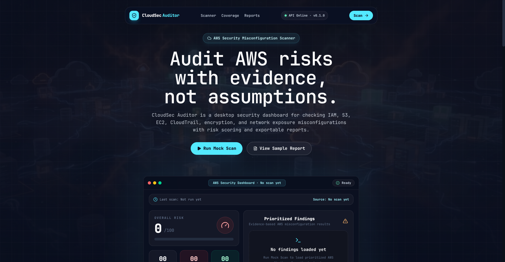
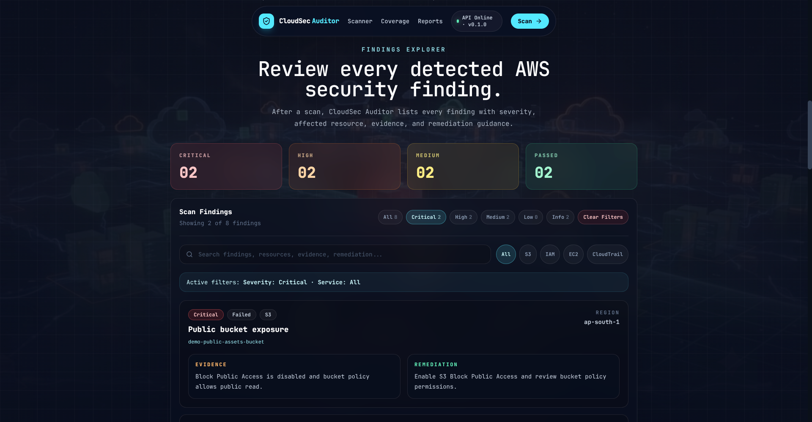
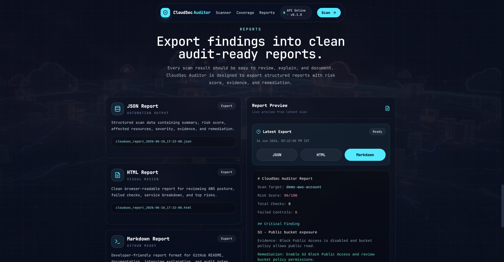
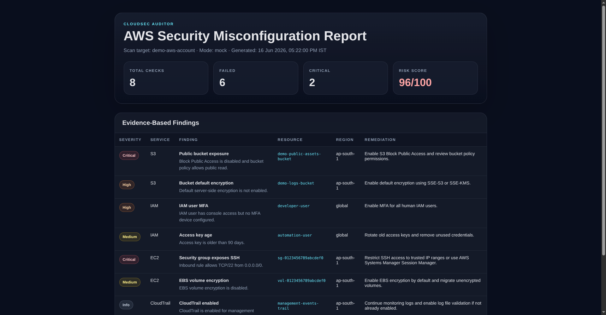
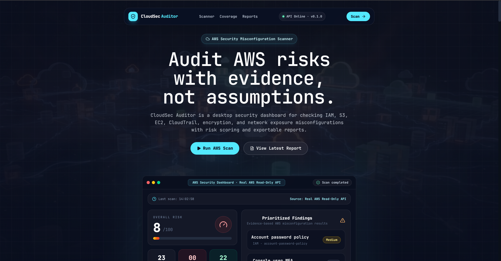
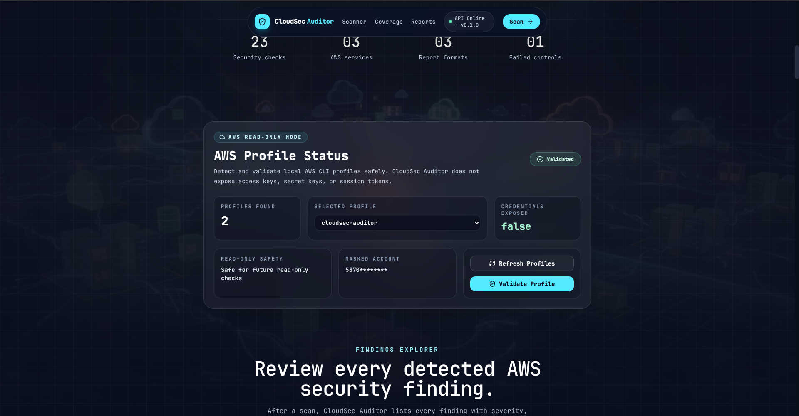
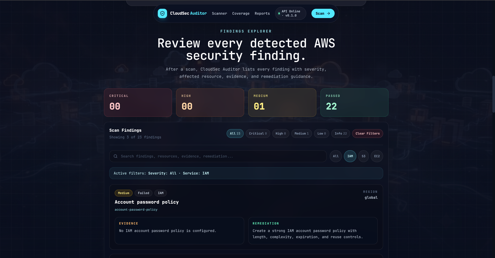
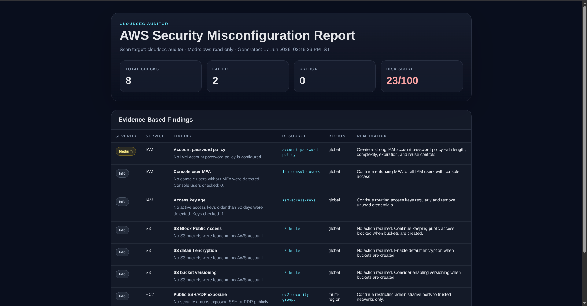
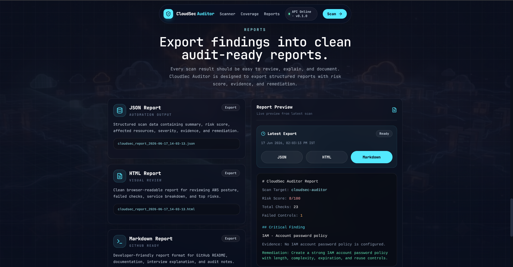

# CloudSec Auditor

**CloudSec Auditor** is a local-first AWS security misconfiguration scanner built with a **React + Vite frontend** and **FastAPI backend**. It audits AWS cloud security posture through a local read-only AWS CLI profile, calculates a risk score, prioritizes findings, and generates timestamped **JSON, HTML, and Markdown** reports.

The project is designed for defensive cloud security learning, portfolio demonstration, interview explanation, and future extension into real AWS read-only auditing using `boto3`.

---

## Author

**Prakhar Shakya**
B.Tech CSE — Cybersecurity
Lloyd Institute of Engineering and Technology, Greater Noida
Delhi NCR, India

* GitHub: [@Suspecting](https://github.com/Suspecting)
* LinkedIn: [@Prakhar Shakya](https://www.linkedin.com/in/shakyaprakhar/)

---

## Project Overview

CloudSec Auditor helps identify and present common cloud security misconfigurations in a clean dashboard format. The current version supports **real AWS read-only mode** using a local AWS CLI profile.

It simulates AWS security checks across IAM, S3, EC2, CloudTrail, encryption, and network exposure areas, then generates audit-ready output with evidence and remediation guidance.

---

## Key Features

* Modern AWS-style security dashboard
* FastAPI backend with structured scan APIs
* React frontend with premium dark cybersecurity UI
* Real AWS read-only scan mode using a local AWS CLI profile
* Risk score calculation based on severity
* Prioritized findings with evidence and remediation
* Findings Explorer with:

  * Severity filters
  * Service filters
  * Search functionality
  * Clear filters option
  * Severity summary cards
* Backend health and API version indicator
* Timestamped report export system
* Latest report viewer from frontend
* JSON, HTML, and Markdown report generation
* Report metadata survives page refresh
* Helper scripts for local setup and development
* Local-first security design

---

## Tech Stack

### Frontend

* React
* Vite
* Tailwind CSS
* Framer Motion
* Axios
* Lucide React

### Backend

* Python
* FastAPI
* Uvicorn
* Pydantic
* pathlib
* boto3 active for real AWS read-only mode

---

## Project Structure

```text
CloudSec-Auditor/
├── backend/
│   ├── core/
│   │   ├── __init__.py
│   │   ├── config.py
│   │   ├── error_handlers.py
│   │   └── logging_config.py
│   │
│   ├── routes/
│   │   ├── __init__.py
│   │   ├── report_routes.py
│   │   ├── scan_routes.py
│   │   └── status_routes.py
│   │
│   ├── schemas/
│   │   ├── __init__.py
│   │   └── response_models.py
│   │
│   ├── cloudsec/
│   │   ├── __init__.py
│   │   ├── cloudtrail_checks.py
│   │   ├── ec2_checks.py
│   │   ├── iam_checks.py
│   │   ├── mock_data.py
│   │   ├── report_generator.py
│   │   ├── risk_score.py
│   │   └── s3_checks.py
│   │
│   ├── main.py
│   └── requirements.txt
│
├── desktop/
│   └── frontend/
│       ├── public/
│       ├── src/
│       │   ├── App.jsx
│       │   ├── index.css
│       │   └── main.jsx
│       ├── package.json
│       └── vite.config.js
│
├── reports/
│   └── .gitkeep
│
├── screenshots/
├── scripts/
│   ├── clean_reports.sh
│   ├── run_backend.sh
│   ├── run_frontend.sh
│   ├── setup_backend.sh
│   └── setup_frontend.sh
│
├── .gitignore
└── README.md
```

---

## How It Works

```text
User clicks Scan
        ↓
React frontend calls FastAPI backend
        ↓
Backend returns real AWS read-only security findings
        ↓
Risk score is calculated
        ↓
Dashboard updates with findings
        ↓
Reports are generated
        ↓
Latest JSON, HTML, and Markdown reports become available
```

---

## Security Checks Covered

Implemented read-only checks include:

* S3 public bucket exposure
* S3 bucket default encryption
* IAM users without MFA
* IAM access key age
* EC2 SSH exposure to `0.0.0.0/0`
* EBS encryption status
* CloudTrail audit visibility
* Passed informational checks

Each finding includes:

* Service
* Severity
* Status
* Resource
* Region
* Category
* Evidence
* Remediation guidance

---

## Quick Start with Helper Scripts

CloudSec Auditor includes helper scripts for easier local setup and development.

### Backend Setup

```bash
./scripts/setup_backend.sh
```

### Run Backend

```bash
./scripts/run_backend.sh
```

The backend runs at:

```text
http://127.0.0.1:8000
```

FastAPI docs:

```text
http://127.0.0.1:8000/docs
```

### Frontend Setup

Open another terminal:

```bash
./scripts/setup_frontend.sh
```

### Run Frontend

```bash
./scripts/run_frontend.sh
```

The frontend runs at:

```text
http://localhost:5173
```

### Clean Generated Reports

```bash
./scripts/clean_reports.sh
```

---

## Manual Backend Setup

Open a terminal in the project root:

```bash
cd backend
python3 -m venv .venv
source .venv/bin/activate
pip install -r requirements.txt
uvicorn main:app --reload --host 127.0.0.1 --port 8000
```

Backend runs at:

```text
http://127.0.0.1:8000
```

FastAPI docs:

```text
http://127.0.0.1:8000/docs
```

---

## Manual Frontend Setup

Open another terminal:

```bash
cd desktop/frontend
npm install
npm run dev
```

Frontend runs at:

```text
http://localhost:5173
```

---

## API Endpoints

| Endpoint                       | Method | Purpose                                         |
| ------------------------------ | -----: | ----------------------------------------------- |
| `/`                            |    GET | Root API information                            |
| `/health`                      |    GET | Basic backend health check                      |
| `/api/status`                  |    GET | Backend status, version, mode, and report count |
| `/api/reports/latest`          |    GET | Returns latest report metadata                  |
| `/api/reports/latest/html`     |    GET | Opens latest HTML report                        |
| `/api/reports/latest/json`     |    GET | Opens latest JSON report                        |
| `/api/reports/latest/markdown` |    GET | Opens latest Markdown report                    |

---

## Report Generation

CloudSec Auditor generates timestamped report files inside the `reports/` folder.

Example output:

```text
cloudsec_report_2026-06-16_14-35-22.json
cloudsec_report_2026-06-16_14-35-22.html
cloudsec_report_2026-06-16_14-35-22.md
```

Reports are ignored by Git to keep the repository clean. The folder structure is preserved using:

```text
reports/.gitkeep
```

---

## Screenshots

### Hero Dashboard



### Findings Explorer



### Reports Section



### HTML Report



---

## Security Note

CloudSec Auditor currently supports real AWS read-only scanning through local AWS CLI profiles.

No AWS access keys, secrets, or credentials are stored in the frontend. Real AWS mode is planned for a future version and should only use read-only AWS permissions through local AWS CLI profiles.

Recommended future permissions for real AWS mode:

* SecurityAudit
* ViewOnlyAccess
* Custom least-privilege read-only policy

---

## Current Status

This project currently includes:

* React dashboard
* FastAPI backend
* Real AWS read-only scan engine
* Risk scoring
* Findings explorer
* Report generation
* Latest report serving
* API status indicator
* Helper scripts
* GitHub-ready project structure

---

## Roadmap

Planned improvements:

* Real AWS read-only scanning with `boto3`
* AWS CLI profile selector
* IAM policy analysis
* S3 public access analyzer
* EC2 security group analyzer
* CloudTrail configuration validation
* PDF report export
* Electron desktop packaging
* CI/CD workflow
* Release builds

---

## Disclaimer

This project is built for defensive cloud security auditing, learning, and portfolio demonstration. It should only be used on cloud accounts and environments where proper authorization exists.

<!-- REAL_AWS_MODE_START -->
## Smoke Test

After starting the FastAPI backend, run the safe real AWS smoke test:

    python3 scripts/smoke_test_real_aws.py cloudsec-auditor

The smoke test verifies:

- Backend health
- AWS profile discovery
- AWS profile validation
- Real AWS read-only scan execution
- Real AWS report generation
- Latest report lookup

The script does not print AWS access keys, secret keys, session tokens, raw account IDs, or full ARNs.

## Sanitized Sample Output

Example sanitized real AWS read-only scan output is available in the `samples/` folder:

- [`sample_aws_readonly_scan_sanitized.json`](samples/sample_aws_readonly_scan_sanitized.json)
- [`sample_aws_readonly_scan_sanitized.md`](samples/sample_aws_readonly_scan_sanitized.md)

These samples remove account-specific identity details while preserving the structure of real scan results.

<!-- README_POLISH_START -->
## Project Status

**CloudSec Auditor** is now a real AWS read-only security posture scanner with a React dashboard, FastAPI backend, boto3-based AWS checks, risk scoring, and exportable JSON, HTML, and Markdown reports.

The project started as a safe AWS security dashboard and has been upgraded into a real read-only AWS auditing tool for authorized environments.

### Current Capabilities

- Detects local AWS CLI profiles safely
- Validates AWS profile identity through STS
- Runs real AWS read-only checks using boto3
- Audits IAM, S3, EC2 security groups, and CloudTrail
- Calculates severity counts and overall risk score
- Generates audit-ready JSON, HTML, and Markdown reports
- Provides a dark cyber-style React dashboard for viewing findings
- Includes sanitized sample output and updated screenshots

### Real AWS Services Covered

| Service | Checks |
|---|---|
| IAM | Password policy, console MFA, access key age |
| S3 | Block Public Access, default encryption, versioning |
| EC2 | Public SSH/RDP exposure across enabled regions |
| CloudTrail | Trail existence and logging visibility |

### Safety Model

- Read-only AWS API calls only
- No resource creation, modification, or deletion
- No AWS access keys, secret keys, or session tokens printed
- AWS account identity is masked in API responses
- Intended only for authorized cloud security auditing

### Demo Flow

1. Start the FastAPI backend.
2. Start the React frontend.
3. Validate the local AWS CLI profile.
4. Run AWS read-only scan.
5. Review prioritized findings.
6. Export JSON, HTML, or Markdown reports.

<!-- README_POLISH_END -->

## Updated Screenshots

### Real AWS Read-Only Dashboard



### AWS Profile Status



### Findings Explorer



### Real AWS HTML Report



### Reports Section



## Real AWS Read-Only Mode

CloudSec Auditor supports real AWS read-only security scanning through a local AWS CLI profile. The backend validates the selected profile, confirms AWS identity through STS, and runs defensive checks without exposing credential values.

### Implemented Real AWS Checks

| Service | Check | Purpose |
|---|---|---|
| IAM | Account password policy | Detects missing IAM password policy controls |
| IAM | Console user MFA | Detects IAM users with console access but no MFA |
| IAM | Access key age | Detects active access keys older than 90 days |
| S3 | Block Public Access | Checks whether buckets block public access |
| S3 | Default encryption | Checks whether buckets enforce server-side encryption |
| S3 | Bucket versioning | Checks whether buckets have versioning enabled |
| EC2 | Public SSH exposure | Detects security groups exposing TCP/22 publicly |
| EC2 | Public RDP exposure | Detects security groups exposing TCP/3389 publicly |
| CloudTrail | Trail configured | Detects missing CloudTrail trails |
| CloudTrail | Logging enabled | Checks whether CloudTrail trails are actively logging |

### Security Model

CloudSec Auditor is designed for defensive and authorized auditing only.

- Uses local AWS CLI profiles
- Uses read-only AWS API calls
- Does not print or store AWS access keys
- Does not expose secret keys or session tokens
- Does not modify, create, or delete AWS resources
- Masks sensitive account identity details in API responses

Recommended AWS permissions for testing:

    SecurityAudit
    ViewOnlyAccess

Do not use root credentials. Do not commit `.aws/`, access keys, screenshots of secrets, or raw AWS credential files.

### AWS Profile Setup

Configure a local AWS CLI profile:

    aws configure --profile cloudsec-auditor

Validate the configured profile:

    aws sts get-caller-identity --profile cloudsec-auditor

### Backend Endpoints

| Endpoint | Description |
|---|---|
| `GET /api/aws/profiles` | Lists local AWS CLI profile names safely |
| `GET /api/aws/profiles/{profile_name}/validate` | Validates a selected AWS profile through STS |
| `GET /api/scan/aws/{profile_name}` | Runs real AWS read-only IAM, S3, and EC2 checks |

### Example Real AWS Scan Result

A fresh AWS account may return a result similar to:

    total_checks: 23
    passed: 22
    failed: 1
    critical: 0
    risk_score: 8

The most common initial finding is a missing IAM account password policy.

### Current Limitation

Real AWS scanning and report export are implemented for IAM, S3, EC2 security group, and CloudTrail checks.
<!-- REAL_AWS_MODE_END -->

## Desktop App Build

CloudSec Auditor can run as an Electron desktop application.

### Linux AppImage

Build the backend binary first:

    cd backend
    source .venv/bin/activate
    python -m PyInstaller --noconfirm --clean --onefile --name cloudsec-backend desktop_server.py

Then build the Electron AppImage:

    cd ../desktop/frontend
    npm install
    npm run electron:build

The Linux AppImage is generated inside:

    desktop/frontend/release/

### Desktop Runtime Behavior

The desktop app bundles the React frontend and starts the FastAPI backend automatically from a bundled backend binary.

At runtime:

1. Electron opens the desktop window.
2. The bundled backend starts on `127.0.0.1:8000`.
3. The React dashboard connects to the local backend.
4. Reports open inside a dedicated Electron report window.

AWS credentials are never bundled. The app uses the user's local AWS CLI profile for authorized read-only scanning.

### Windows EXE

Windows builds should be generated on a Windows machine or through GitHub Actions. The Windows installer/portable EXE will use the same Electron app structure, but requires a Windows backend binary built with PyInstaller on Windows.

